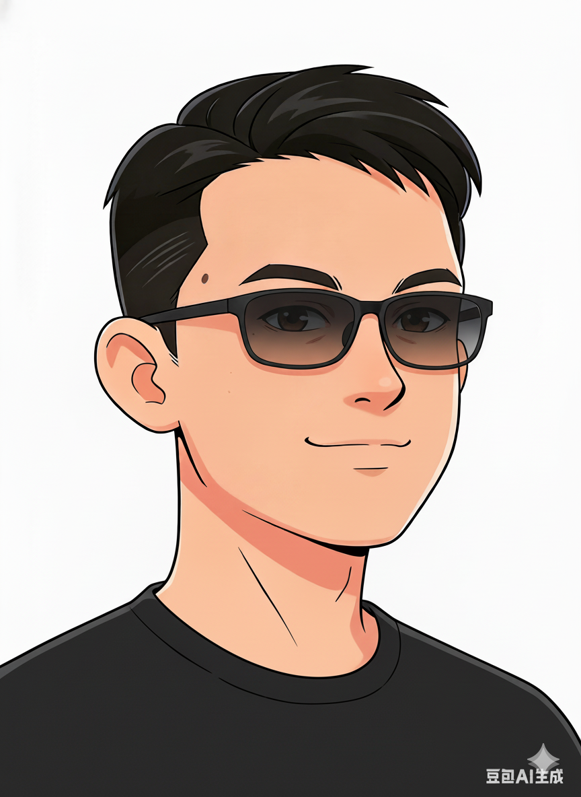

---
hide:
    - navigation
    - toc
---

<div class="grid cards" markdown>

-   🛠️ __技术博客__

    ---

    深入探讨各种技术话题，主要聚焦于计算机科学的各个领域。

    [:octicons-arrow-right-24: 开始阅读](blog/index.md)

-  :musical_note: __音乐空间__

    ---

    分享我喜欢的音乐，也可能会有游戏、电影、书籍等相关内容的分享。

    [:octicons-arrow-right-24: 探索空间](musicspace/index.md)

-   :link: __网上邻居__

    ---

    我的外部链接与项目，以及朋友们的博客，欢迎访问。

    [:octicons-arrow-right-24: 启动连接](friends.md)

-   :memo: __关于本站__

    ---

    了解本站的构建过程和技术细节。

    [:octicons-arrow-right-24: 查看详情](diary.md)


</div>

---

> 生活在这个世界上的人：有的是弱者，有的是强者；有的要别人来设定目标，有的给别人设定目标；有的需要感情支持生活，有的需要意志支持生活。我大概在每一对概念中都会选择做后一种人。
{: .book}

> ——摘自《政治的人生》
{: .booksource}

---

<div class="about-container" markdown="1">

{.profile-pic}

<div markdown="1">

## 关于我

北航计算机学院本科生一枚。

</div>

</div>


=== "C++"
    ```cpp
    #include <iostream>
    int main() {
        std::cout << "Hello, World!" << std::endl;
        return 0;
    }
    ```
=== "python"
    ```python
    def greet():
        print("Hello, World!")
    greet()
    ```
=== "verilog"
    ```verilog
    module hello_world;
    initial begin
        $display("Hello, World!");
        $finish;
    end
    endmodule
    ```
=== "java"
    ```java
    public class HelloWorld {
        public static void main(String[] args) {
            System.out.println("Hello, World!");
        }
    }
    ```