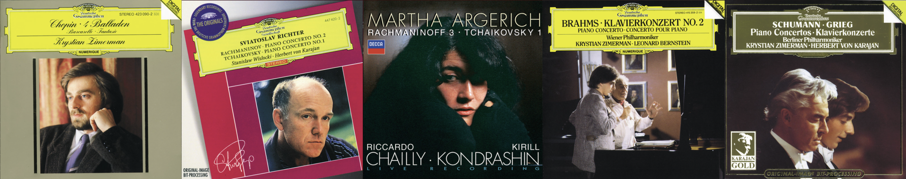

# 古典序章：肖邦叙事曲与拉赫、勃拉姆斯、舒曼钢琴协奏曲

我未曾习得专业的音乐理论知识，亦无精通的乐器演奏技能，对于古典音乐的理解和欣赏，更多地依赖于个人的听觉体验。私以为，古典似茶，初品时平淡生涩，反复回味却韵味无穷。兴奋时，听古典音乐通常听不下去；而往往在在平淡的生活与工作中，其味道才会逐渐显现。就个人的体验来说，初听一首大型的钢协或者交响时，往往会觉得过于冗长，也无法领会其中的旋律细节与情绪变化；但反复聆听之后，对于乐章旋律都有了些熟悉，就能更深入地融入音乐的情绪中，体会到其中的细腻与丰富。

通常，古典音乐是我学习工作时的白噪音。大型的交响或者钢协，往往持续四五十分钟的时间，很难有大片的时间去专注地听完一首作品；但在工作时，偶尔听到其中的旋律片段，或者某个乐章的高潮部分，情绪微微触动，仿佛在忙碌中偶然品尝到一杯清茶，带来一丝清新和愉悦。

<!-- more -->

大学以前，我听的古典音乐较为大众化，大多来自通识的音乐课程教育。进入大学后，受 SH 老师课程的影响，开始接触更为专业的古典音乐作品。在 2025 年下半年，我开始听一些大型的钢协作品，从肖邦的叙事曲，到柴一、拉二、拉三、勃二、舒曼、普二等钢琴协奏曲，作为一个外行也算是初窥门径。

!!! note 
    本文章的日期并不代表一个确切的时间点，而是一个大致的时间范围，表示我在 2025 年下半年内的古典音乐探索的总结和回顾。

## 肖邦叙事曲

在 SH 老师的课程中观看了电影《钢琴家》中演绎的肖邦叙事曲一号 (Ballade No.1 in G minor, Op. 23) 片段，后来逐渐听完了肖邦所有四首叙事曲。齐默尔曼（Krystian Zimerman）的演绎版本十分出色。

<iframe data-testid="embed-iframe" style="border-radius:12px" src="https://open.spotify.com/embed/playlist/6XmQ77fEuB6E0jNmniGkC6?utm_source=generator" width="100%" height="410" frameBorder="0" allowfullscreen="" allow="autoplay; clipboard-write; encrypted-media; fullscreen; picture-in-picture" loading="lazy"></iframe>

## 拉赫玛尼诺夫第二钢琴协奏曲 (Piano Concerto No.2 in C minor, Op. 18)

里赫特（Sviatoslav Richter）版本，华沙爱乐乐团。

<iframe data-testid="embed-iframe" style="border-radius:12px" src="https://open.spotify.com/embed/playlist/4X4RrJvY5wGKmXD1Va25tN?utm_source=generator" width="100%" height="352" frameBorder="0" allowfullscreen="" allow="autoplay; clipboard-write; encrypted-media; fullscreen; picture-in-picture" loading="lazy"></iframe>

## 拉赫玛尼诺夫第三钢琴协奏曲 (Piano Concerto No.3 in D minor, Op. 30)

玛尔塔·阿格里奇（Martha Argerich）版本，柏林广播交响乐团。

<iframe data-testid="embed-iframe" style="border-radius:12px" src="https://open.spotify.com/embed/playlist/6RkACmRPKnnl9ox8DVIo6E?utm_source=generator" width="100%" height="352" frameBorder="0" allowfullscreen="" allow="autoplay; clipboard-write; encrypted-media; fullscreen; picture-in-picture" loading="lazy"></iframe>

## 勃拉姆斯第二钢琴协奏曲 (Piano Concerto No.2 in B-flat major, Op. 83)

齐默尔曼（Krystian Zimerman）版本，维也纳爱乐乐团，伯恩斯坦（Leonard Bernstein）指挥。

<iframe data-testid="embed-iframe" style="border-radius:12px" src="https://open.spotify.com/embed/album/3QvQAnQwuUfSuwj5orGeeY?utm_source=generator" width="100%" height="410" frameBorder="0" allowfullscreen="" allow="autoplay; clipboard-write; encrypted-media; fullscreen; picture-in-picture" loading="lazy"></iframe>

## 舒曼钢琴协奏曲 (Piano Concerto in A minor, Op. 54)

齐默尔曼（Krystian Zimerman）版本，柏林爱乐乐团，卡拉扬（Herbert von Karajan）指挥。

<iframe data-testid="embed-iframe" style="border-radius:12px" src="https://open.spotify.com/embed/playlist/55wf4CKJlu4goH57JJpq0k?utm_source=generator" width="100%" height="352" frameBorder="0" allowfullscreen="" allow="autoplay; clipboard-write; encrypted-media; fullscreen; picture-in-picture" loading="lazy"></iframe>